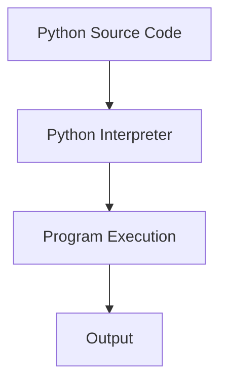

#  Introduction to Python

## What is Programming?

Programming is a process of giving instructions to a computer to perform specific task. Ot involves writing code in a programming language that the computer can understand and execute.


## What is Python?

Python is a **high level, general purpose and interpreted programming language** known for its simple and readable syntax.

It was created by **Guido van Rossum** and was first released in **1991**.

Python allows developers to write programs using syntax that is relatively easy for humans to read and understand.

### Example

```python
print("Hello, World!")
```

This single line tells Python to display:

```text
Hello, World!
```

---

##  Why Learn Python?

Python is one of the most widely used programming languages.

Some major reasons include:

### 1. Easy to Read

Python syntax is simple and clean.

```python
name = "Arnav"
print(name)
```

The code is easy to understand even for beginners.

---

### 2. Beginner Friendly

Python does not require a large amount of complicated syntax for basic programs.

For example:

```python
print("Welcome to Python")
```

---

### 3. Versatile

Python is used in many different areas of technology.

Examples include:

* Web Development
* Data Science
* Artificial Intelligence
* Machine Learning
* Automation
* Cybersecurity
* Scientific Computing
* Desktop Applications
* Scripting
* Backend Development

---

##  Where is Python Used?

### Web Development

Python can be used to create web applications using frameworks such as:

* Django
* Flask
* FastAPI

---

###  Artificial Intelligence & Machine Learning

Python is heavily used in:

* Machine Learning
* Deep Learning
* Generative AI
* Natural Language Processing
* Computer Vision

Popular libraries include:

```text
NumPy
Pandas
Scikit-learn
TensorFlow
PyTorch
```

---

###  Data Science

Python is commonly used to:

* Analyze data
* Clean datasets
* Create visualizations
* Build predictive models

---

###  Automation

Python can automate repetitive tasks.

For example:

```text
Rename files
Read files
Process data
Send automated reports
Perform repetitive operations
```

---

###  Cybersecurity

Python can be used for:

* Security automation
* Network programming
* Log analysis
* Security tools
* Penetration-testing scripts
* Data analysis

---

###  Game Development

Also used for game development

* Pygame
* Panda3D
* Arcade
* Godot (with Python / GDScript)
* PyOpenGL
---


##  Features of Python

Some important features of Python are:

* Simple syntax
* Readable code
* High-level language
* Dynamically typed
* Interpreted
* Object-oriented
* Cross-platform
* Large standard library
* Huge ecosystem of third-party packages
* Open source

---

##  Python Example

Consider:

```python
name = "Arnav"
age = 20

print("Name:", name)
print("Age:", age)
```

Output:

```text
Name: Arnav
Age: 20
```

Python lets us express the logic without writing a large amount of code.

---

##  Python 2 vs Python 3

There are two major versions that you may hear about:

```text
Python 2
Python 3
```

Python 2 is obsolete and is no longer supported.

You should learn and use **Python 3**.

Throughout this repository, all examples are written for Python 3.

---

##  Python File Extension

Python programs normally use:

```text
.py
```

For example:

```text
hello.py
calculator.py
practice.py
```

---

##  What Happens When We Run Python?

Suppose we create:

```text
hello.py
```

containing:

```python
print("Hello, Python!")
```

When we run the program, Python processes the code and executes the instructions.

Conceptually:





---

##  Important Terms

### Programming Language

A language used to communicate instructions to a computer.

Examples:

```text
Python
C
C++
Java
JavaScript
```

### Source Code

The code written by the programmer.

Example:

```python
print("Hello")
```

### Interpreter

A program that executes Python code.

### Program

A collection of instructions that tells a computer what to do.

---

##  Key Takeaways

Remember these points:

1. Python is a high-level programming language.
2. Python was created by Guido van Rossum.
3. Python was first released in 1991.
4. Python is beginner-friendly and readable.
5. Python is used in many technology fields.
6. Python 3 is the version you should learn.
7. Python files normally use the `.py` extension.

---

##  Next

Continue to:

```text
02_Installing_Python.md
```

There you will install Python on your computer.
