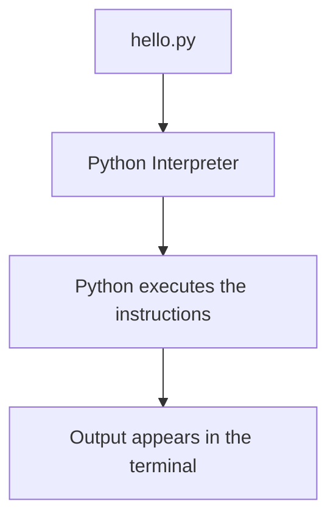

#  Running Python Programs

Once Python is installed and VS Code is configured, you need to know how to run Python programs.

There are several ways to execute Python code.

---

## 1. Running Python Using VS Code

Open a Python file such as:

```text
04_Hello_World.py
```

You can use the **Run Python File** button in VS Code.

The output will appear in the terminal.

Example output:

### Example Output


---

## 2. Running Python Using the Terminal

Open the terminal.

Navigate to the folder containing your Python file.

For example:

```bash
cd Programming-in-Python
```

Then move into the chapter folder:

```bash
cd 01_Getting_Started
```

Run:

```bash
python 04_Hello_World.py
```

---

## 3. Running Python Using `py`

On Windows, you may also use:

```bash
py 04_Hello_World.py
```

Both approaches can execute the Python program.

---

## 4. Running Python Interactively

You can also start Python directly:

```bash
python
```

You will see:

```text
>>>
```

Now you can enter Python code directly.

Example:

```python
>>> print("Hello")
Hello
```

Try:

```python
>>> 10 + 20
30
```

Exit using:

```python
exit()
```

---

## ⚡ VS Code vs Terminal

| Method | Best For |
|---|---|
| VS Code Run Button | Beginners and quick execution |
| `python file.py` | Running programs from the terminal |
| `py file.py` | Running Python on Windows |
| Python Interactive Mode | Testing small pieces of Python code |

---

#  Understanding the Process

When you have:

```text
hello.py
```

and execute:

```bash
python hello.py
```

the general process is:




---

#  Example

Create a file:

```text
test.py
```

Add:

```python
print("Python is working!")
```

Run:

```bash
python test.py
```

Output:

```text
Python is working!
```

---

# ❌ Common Errors

## Error 1 — File Not Found

You may see:

```text
can't open file
```

This usually means the terminal is not currently inside the folder containing the file.

Check your current directory.

On Windows:

```bash
dir
```

Look for your Python file.

---

## Error 2 — Python Not Found

If:

```bash
python --version
```

does not work, Python may not be installed correctly or may not be available through PATH.

Refer back to:

```text
02_Installing_Python.md
```

---

## Error 3 — Typing the Wrong Filename

If your file is:

```text
04_Hello_World.py
```

run:

```bash
python 04_Hello_World.py
```

not:

```bash
python Hello.py
```

The filename must match.

---

#  Important Commands

| Command            | Purpose                    |
| ------------------ | -------------------------- |
| `python --version` | Check Python version       |
| `python`           | Start Python interpreter   |
| `python file.py`   | Run a Python file          |
| `py file.py`       | Run Python file on Windows |
| `exit()`           | Exit Python interpreter    |
| `pip --version`    | Check pip                  |

---

#  Practice

Try running:

```text
04_Hello_World.py
```

using both:

```bash
python 04_Hello_World.py
```

and:

```bash
py 04_Hello_World.py
```

Then compare the results.

---

## ➡️ Next

Continue to:

```text
06_Python_Syntax.py
```

to learn the basic rules of Python code.
