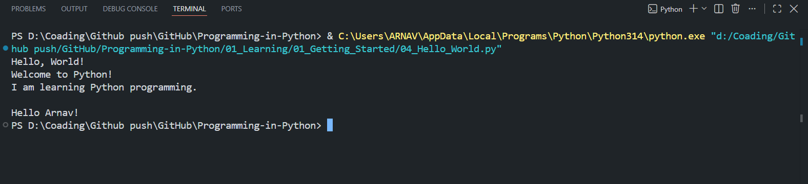
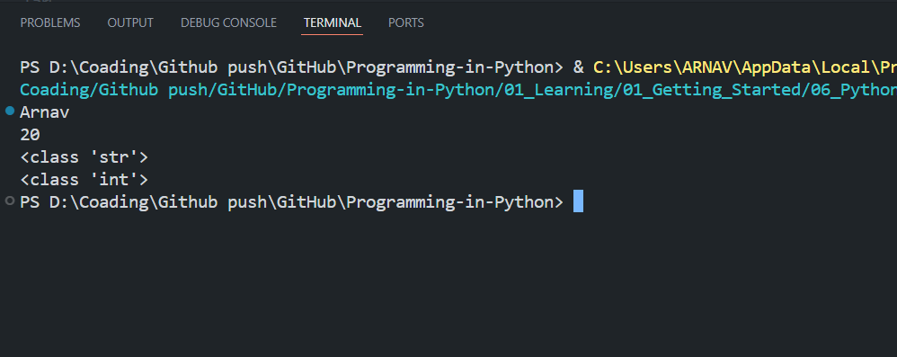
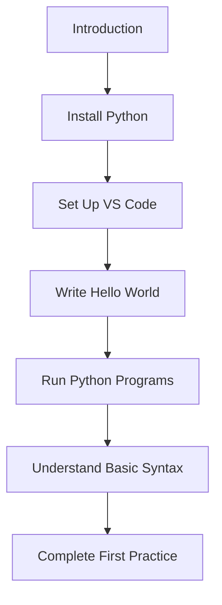
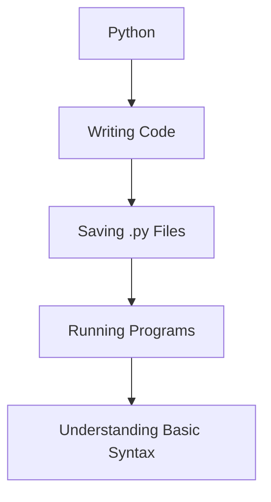

#  Getting Started with Python

Welcome to the first chapter of **Programming-in-Python**.

This section introduces the fundamentals of Python and helps you set up everything required to start writing and running Python programs.

If you are completely new to Python, follow the files in the order given below.

---

##  What You Will Learn

By completing this chapter, you will understand:

* What Python is
* Why Python is popular
* Where Python is used
* How to install Python
* How to verify a Python installation
* How to set up VS Code for Python
* How to write your first Python program
* How to run a Python program
* What Python syntax means
* Basic Python indentation and comments
* How to write your first practice program

---

##  Chapter Contents

| #  | File                            | Topic                   |
| -- | ------------------------------- | ----------------------- |
| 01 | `01_Introduction_to_Python.md`  | Introduction to Python  |
| 02 | `02_Installing_Python.md`       | Installing Python       |
| 03 | `03_Setting_Up_VS_Code.md`      | Setting up VS Code      |
| 04 | `04_Hello_World.py`             | First Python Program    |
| 05 | `05_Running_Python_Programs.md` | Running Python Programs |
| 06 | `06_Python_Syntax.py`           | Basic Python Syntax     |
| 07 | `07_First_Practice.py`          | First Practice Program  |

---


##  04 - Hello World Preview

### Code
```python
print("Hello, World!")
print("Welcome to Python!")
print("I am learning Python programming.")
print()  

print('Hello Arnav!')
```
### Output



> 📌 This is a simplified preview. Full code with a detailed explanation is available in `04_Hello_World.py`.

---

## 06 - Python Syntax Preview

Here is a small preview of the Python syntax covered in this lesson.

### Code

```python
name = "Arnav"
age = 20

print(name)
print(age)

print(type(name))
print(type(age))
```

### Output


> 📌 This is a simplified preview. Full code with a detailed explanation is available in `06_Python_Syntax.py`.
---


##  Recommended Learning Order

Follow this sequence:



---

##  Goal of This Chapter

The goal is not to become an expert in Python.

The goal is to become comfortable with:





After completing this chapter, you should be able to create a Python file and run a simple Python program without assistance.

---

##  Tools Required

You will need:

* Python 3
* Visual Studio Code
* Python extension for VS Code
* A terminal / command prompt
* Basic computer knowledge

---

##  Practice

The final file:

```text
07_First_Practice.py
```

contains a small beginner-level practice program.

Try to understand the code yourself before looking at the explanation.

---

## ✅ Chapter Checklist

* [x] Understand what Python is
* [x] Install Python
* [x] Verify Python installation
* [x] Install VS Code
* [x] Install the Python extension
* [x] Create your first `.py` file
* [x] Run a Python program
* [x] Understand basic Python syntax
* [x] Complete the first practice program

---

##  What's Next?

After completing **Getting Started**, continue with:

```text
02_Python_Funadmentals/
```

There you will begin learning actual Python programming concepts such as:

* Variables
* Data Types
* Input and Output
* Type Conversion
* Basic Operations
* And more

---

>  **Tip:** Don't just read the files. Type the examples yourself and run them. Programming is learned by writing and experimenting with code.
