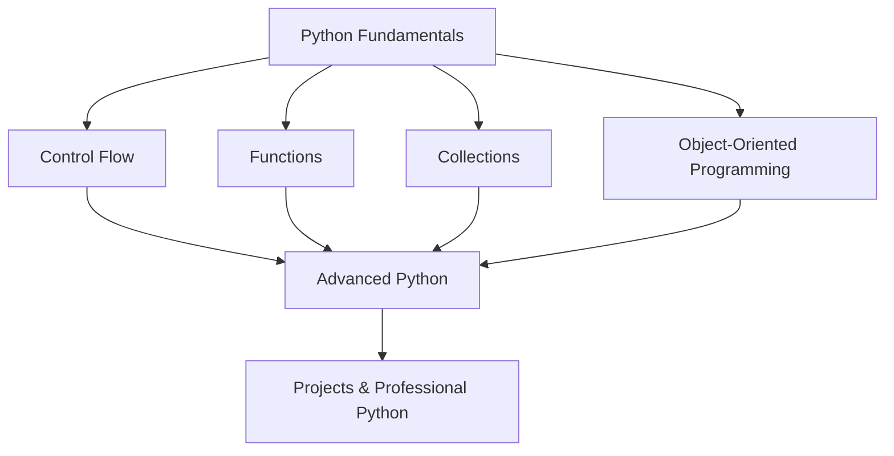
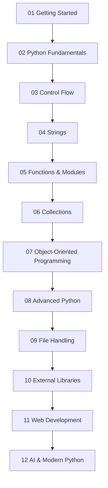
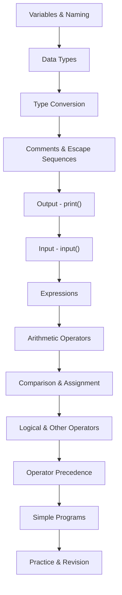
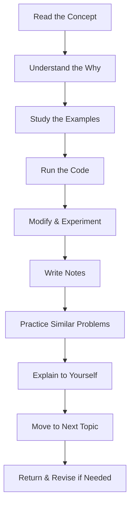

#  Python Fundamentals

> Building the core foundation required to understand and write Python programs confidently.

---

##  Welcome

Welcome to **Python Fundamentals**, the first major core Python learning module after Getting Started.

This module introduces the essential building blocks required to write functional Python programs. Here you will learn about variables, data types, operators, input/output, and how to express logic using Python's core language features.

Python Fundamentals is where Python moves from basic syntax into actual programming. These concepts become the building blocks for everything that follows control flow, functions, collections, object-oriented programming, and advanced Python.

---

##  Purpose of This Module

Python Fundamentals exists to answer the question: **"What do I need to know to write a simple Python program?"**

After Getting Started (which covered installation and execution), Fundamentals teaches you:

- How to store information using variables
- What different data types represent and how to use them
- How to take input from users
- How to display output to users
- How to convert values between types
- How to express calculations and logic using operators
- How to combine these concepts into small working programs

These concepts may seem simple, but they form the foundation for every more complex Python program you will write. Without mastery of these fundamentals, more advanced topics like functions, loops, and classes will feel confusing.

### Why This Module Matters

Fundamentals skills enable:



Everything builds from Fundamentals.

---

##  Module Objectives

After completing this module, you should be able to:

- ✅ Create and use variables to store data
- ✅ Understand Python's basic data types (`int`, `float`, `str`, `bool`, `complex`)
- ✅ Convert values between different types
- ✅ Take user input using `input()`
- ✅ Display output using `print()` with formatting
- ✅ Work with comments and escape sequences
- ✅ Write and evaluate expressions
- ✅ Use arithmetic operators (`+`, `-`, `*`, `/`, `//`, `%`, `**`)
- ✅ Use assignment operators (`=`, `+=`, `-=`, etc.)
- ✅ Use comparison operators (`==`, `!=`, `<`, `>`, `<=`, `>=`)
- ✅ Use logical operators (`and`, `or`, `not`)
- ✅ Understand identity and membership operators
- ✅ Understand operator precedence
- ✅ Combine fundamental concepts into small Python programs

---

##  Where This Module Fits in the Learning Journey



**Python Fundamentals** is the bridge between learning to run Python and learning to program with Python.

It teaches the language building blocks that every Python program depends on.

---

##  Topics Covered

### Variables & Naming

Variables are the containers where programs store information. You'll learn:

- What variables are and why they're needed
- How to create variables and assign values
- Python naming conventions and best practices
- Variable types and how Python infers them

### Data Types

Python represents different kinds of information with different data types:

- **Integer (`int`)** — Whole numbers like `42`, `-10`, `0`
- **Float (`float`)** — Decimal numbers like `3.14`, `-2.5`, `0.0`
- **Complex (`complex`)** — Complex numbers (less common in early learning)
- **Boolean (`bool`)** — Truth values: `True` or `False`
- **String (`str`)** — Text data like `"Hello"`

Understanding data types helps you use the right tool for the right job.

### Type Conversion & Casting

Values sometimes need to be converted from one type to another:

- Converting strings to numbers using `int()` and `float()`
- Converting numbers to strings using `str()`
- Converting values to booleans using `bool()`
- Explicit conversion vs. automatic type coercion
- Common conversion pitfalls

### User Input & Output

Programs need to interact with users:

- Using `input()` to read data from the user
- Understanding that `input()` returns a string
- Using `print()` to display output
- Formatting output for clarity
- Escape sequences like `\n` (newline) and `\t` (tab)

### Comments & Documentation

Good code explains itself:

- Single-line comments using `#`
- Multi-line comments using triple quotes
- Why comments matter
- Comment best practices

### Expressions & Operators

Operators perform actions on values:

#### Arithmetic Operators
- `+` Addition
- `-` Subtraction
- `*` Multiplication
- `/` Division (returns float)
- `//` Floor division (returns integer)
- `%` Modulus (remainder)
- `**` Exponentiation

#### Assignment Operators
- `=` Basic assignment
- `+=`, `-=`, `*=`, `/=` and others (compound assignment)

#### Comparison Operators
- `==` Equal to
- `!=` Not equal to
- `<` Less than
- `>` Greater than
- `<=` Less than or equal
- `>=` Greater than or equal

#### Logical Operators
- `and` — Both conditions must be true
- `or` — At least one condition must be true
- `not` — Negates a condition

#### Identity Operators
- `is` — Checks if two variables refer to the same object
- `is not` — Checks if two variables don't refer to the same object

#### Membership Operators
- `in` — Checks if value exists in a sequence
- `not in` — Checks if value doesn't exist in a sequence

#### Bitwise Operators
- `&` (AND), `|` (OR), `^` (XOR), `~` (NOT), `<<` (left shift), `>>` (right shift)
- (More commonly used in advanced Python and systems programming)

### Operator Precedence

When multiple operators appear in an expression, Python follows an order of precedence to determine which operations happen first. Understanding precedence helps you write correct expressions and predict results.

---

##  Fundamentals Roadmap

This is the learning progression within this module:



Each concept builds on earlier ones. Don't rush forward without understanding the previous concepts.

---

##  Module Folder Structure

```text
02_Python_Fundamentals/
│
├── README.md (this file)
│
├── 01_Variables.py
├── 02_Data_Types.py
├── 03_Type_Conversion.py
├── 04_Comments_and_Escape_Sequences.py
├── 05_Input_and_Output.py
├── 06_Operators_Arithmetic.py
├── 07_Operators_Comparison_and_Assignment.py
├── 08_Operators_Logical.py
├── 09_Operators_Identity_and_Membership.py
├── 10_Operators_Bitwise.py
├── 11_Operator_Precedence.py
│
└── practice/
    ├── practice_problem_01.py
    ├── practice_problem_02.py
    ├── practice_problem_03.py
    └── practice_problem_04.py

```

*Note: This is the intended structure. Files will be added progressively as the module is developed.*

---

##  File-by-File Guide

This section describes what each file will contain as it is created.

| File | Purpose |
|------|---------|
| `01_Variables.py` | Demonstrates variable creation, assignment, naming conventions, and variable reassignment. |
| `02_Data_Types.py` | Covers `int`, `float`, `bool`, `str`, `complex` with examples and `type()` function. |
| `03_Type_Conversion.py` | Shows explicit type conversion using `int()`, `float()`, `str()`, `bool()` and common gotchas. |
| `04_Comments_and_Escape_Sequences.py` | Explains single-line comments, multi-line comments, and escape sequences like `\n`, `\t`, `\\`. |
| `05_Input_and_Output.py` | Demonstrates `print()` with formatting, `input()` function, and interactive programs. |
| `06_Operators_Arithmetic.py` | Covers `+`, `-`, `*`, `/`, `//`, `%`, `**` with examples and order of operations. |
| `07_Operators_Comparison_and_Assignment.py` | Demonstrates comparison operators (`==`, `!=`, `<`, `>`, `<=`, `>=`) and assignment operators (`=`, `+=`, etc.). |
| `08_Operators_Logical.py` | Covers `and`, `or`, `not` operators with truth tables and practical examples. |
| `09_Operators_Identity_and_Membership.py` | Explains `is`, `is not`, `in`, `not in` operators. |
| `10_Operators_Bitwise.py` | Covers bitwise operators for those interested in lower-level operations. |
| `11_Operator_Precedence.py` | Demonstrates how Python evaluates expressions with multiple operators. |


##  Concept Overview

### Variables

**What are variables?**

A variable is a named container that holds a value. It allows your program to store information and refer to it later by name, rather than repeating the value everywhere.

```python
name = "Arnav"
age = 20
price = 19.99
```

In this example, `name`, `age`, and `price` are variables that store data. Python's style guide (PEP 8) recommends lowercase names with underscores for variable names: `user_name`, `student_age`, `product_price`.

### Data Types

**Why do we need different types?**

Different data types represent different kinds of information. Python needs to know if something is a number or text because the operations you can perform differ.

```python
x = 42          # Integer
y = 3.14        # Float
name = "Python" # String
is_fun = True   # Boolean
```

The `type()` function tells you what type a value is: `type(42)` returns `<class 'int'>`.

### Type Conversion

**Why convert types?**

Often you need to convert data from one type to another. For example, `input()` always returns a string, even if the user types a number. To use that number in calculations, you must convert it to an integer or float.

```python
age_string = input("Enter your age: ")  # Returns "20"
age_number = int(age_string)             # Converts to 20
```

### Input & Output

**How do programs interact?**

- `print()` displays information to the user
- `input()` reads information from the user

These are the primary ways Python programs communicate with users.

### Expressions & Operators

**What are expressions?**

An expression is a combination of values and operators that Python evaluates to produce a result.

```python
result = 10 + 5         # Expression: 10 + 5
print(result)           # Output: 15
x = 10 < 20             # Expression: 10 < 20, result is True
```

**What are operators?**

Operators are symbols that perform specific operations. Python has many types: arithmetic (`+`, `-`), comparison (`<`, `>`), logical (`and`, `or`), and others.

---

##  Learning Workflow

The recommended approach to learning Fundamentals is:



### Detailed Workflow

1. **Read the Concept**: Read the concept explanation and understand the purpose
2. **Understand the Why**: Know not just *how* to use something, but *why* it matters
3. **Study Examples**: Look at working code examples
4. **Run the Code**: Execute the examples yourself to see results
5. **Modify & Experiment**: Change values, test edge cases, break things on purpose
6. **Write Notes**: Jot down key points in your own words
7. **Practice**: Solve problems that require using this concept
8. **Explain**: Explain the concept to yourself or someone else
9. **Move Forward**: Proceed to the next concept
10. **Revise**: Revisit earlier concepts if later topics don't make sense

---

##  Practice Philosophy

The goal is not merely to understand Python in theory, but to develop practical programming skill.

Understanding has stages:

```
"I know the concept"
     ↓
"I understand the concept"
     ↓
"I can implement the concept"
     ↓
"I can use it to solve problems"
     ↓
"I can teach it to others"
```

Each file includes both **explanation and examples**. The practice folder contains **problems of increasing difficulty** that require you to:

- Apply one concept in different ways
- Combine multiple concepts
- Think through simple problem-solving
- Build confidence through small wins

**Don't just watch code being written. Write it yourself. Run it. Break it. Fix it. Then move on.**

---

##  Common Beginner Mistakes

Being aware of these early helps you avoid them:

| Mistake | Example | Fix |
|---------|---------|-----|
| Confusing `=` and `==` | `if x = 5:` | Use `=` for assignment, `==` for comparison |
| Forgetting `input()` returns a string | `age = input("Age?")` then `age + 1` | Convert: `age = int(input("Age?"))` |
| Mixing string and number operations | `"5" + 5` | Convert to same type: `int("5") + 5` |
| Missing quotes on strings | `print(hello)` | Strings need quotes: `print("hello")` |
| Incorrect variable naming | Variable names with spaces or starting with numbers | Use valid names: `my_variable`, `user_age` |
| Misunderstanding operator precedence | `2 + 3 * 4` expecting 20 instead of 14 | Remember: multiplication before addition |
| Not understanding `input()` always returns strings | `num = input("Enter 5")` expecting an integer | Always explicitly convert: `num = int(input(...))` |
| Using wrong comparison operator | `if age = 18:` | Use `==` for comparison, not `=` |
| Confusing `and` and `or` | `if x > 5 or x < 10:` (always true!) | Think clearly about logic |

Study these early and you'll catch errors faster.

---

##  Revision Checklist

Use this checklist to verify you understand each topic:

### Core Concepts

- [x] I can create a variable and assign a value
- [x] I understand Python variable naming conventions
- [x] I know the difference between `int`, `float`, `bool`, and `str`
- [x] I can use `type()` to check a value's type
- [x] I understand that `input()` returns a string
- [x] I can convert between different types using `int()`, `float()`, `str()`, `bool()`


## Input & Output

- [x] I can use `print()` to display output
- [x] I understand escape sequences (`\n`, `\t`, `\\`, `\"`)
- [x] I can use `input()` to read user input
- [x] I can format `print()` output using multiple arguments
- [x] I can use `sep` and `end` with `print()`
- [x] I can use f-strings to format output
- [x] I can take multiple values from one line using `split()` and `map()`

### Expressions & Operators

- [x] I can write arithmetic expressions and predict results
- [x] I understand the difference between `/` and `//`
- [x] I understand the `%` (modulus) operator
- [x] I understand the `**` (exponentiation) operator
- [x] I know what comparison operators return (`True` or `False`)
- [x] I understand `and`, `or`, and `not` operators
- [x] I understand short-circuit evaluation in logical operations
- [x] I know when to use assignment operators like `+=`
- [x] I understand identity operators (`is` and `is not`)
- [x] I understand membership operators (`in` and `not in`)
- [x] I understand how membership operators work with strings, lists, tuples, sets, dictionaries, and ranges
- [x] **I understand bitwise operators (`&`, `|`, `^`, `~`, `<<`, and `>>`)**
- [x] I understand operator precedence and can predict expression results

### Practice

- [ ] I can write simple programs using variables
- [ ] I can write programs that take input and produce output
- [ ] I can combine multiple concepts into a working program
- [ ] I can debug simple errors in my code
- [ ] I can explain fundamental concepts in my own words

---


**Completion does not mean perfection.** It means the concepts have been sufficiently studied, practiced, and understood to move forward confidently.


---

##  Connection to the Next Module

The next module is **03_Control_Flow**.

After mastering Fundamentals, Control Flow teaches you how to make decisions and repeat actions using:

- **Conditions** (`if`, `elif`, `else`) — Making decisions based on True/False values
- **Loops** (`while`, `for`) — Repeating actions
- **Logical combinations** — Using multiple conditions together

**Example connection:**

```python
# Fundamentals: Check user input
age = int(input("Enter age: "))

# Control Flow: Make a decision with that input
if age >= 18:
    print("You are an adult")
else:
    print("You are a minor")
```

Fundamentals provides the building blocks. Control Flow teaches you how to make those blocks work together intelligently.


---


Your time investment in Fundamentals will pay dividends throughout your entire Python journey.

---

##  Navigation

**← [Back to Python Learning](../README.md)**

**← [Back to Programming-in-Python](../../README.md)**

---

