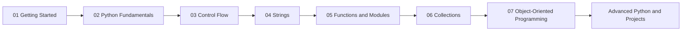
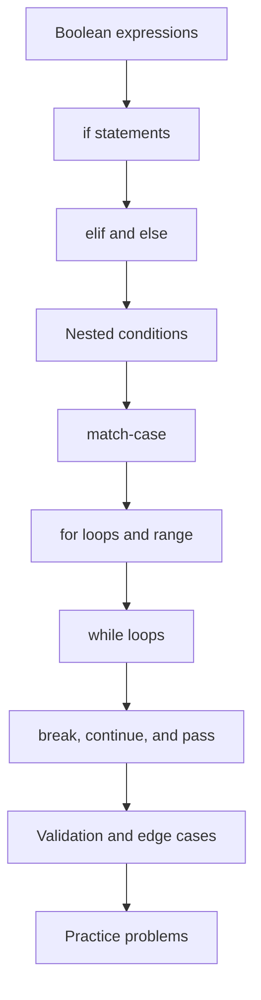

<div align="center">

# 03_Control_Flow

### *Teaching Python how to make decisions, repeat actions, and control execution*


</div>

---

## Welcome

Welcome to **Control Flow**, the third module in the `01_Learning` path of the **Programming-in-Python** repository.

The previous module introduced variables, data types, input, output, and operators. This module builds on those foundations by teaching programs how to make decisions and repeat work. Control flow is the point where separate Python statements begin working together as useful program logic.

> [!NOTE]
> This module is currently being developed. The README defines the learning plan and will be updated as lesson files and practice problems are added.

---

## Purpose of This Module

Control flow answers two important programming questions:

1. **Which instructions should run?**
2. **How many times should they run?**

Python answers these questions with conditions, pattern matching, loops, and loop-control statements. By the end of this module, simple input-and-output programs should be able to respond differently to different situations instead of following one fixed path every time.

---

## Where This Module Fits



**Prerequisites:**

- Variables and assignment
- Basic data types
- `input()` and `print()`
- Comparison and logical operators
- Indentation and basic Python syntax

The previous module, [02_Python_Fundamentals](../02_Python_Fundamentals/), covers these foundations.

---

## Learning Objectives

After completing this module, I should be able to:

- Write conditions with `if`, `elif`, and `else`.
- Combine comparisons with logical operators such as `and`, `or`, and `not`.
- Build nested decision structures when one decision depends on another.
- Use `match-case` for clear multi-option branching.
- Repeat a task with `for` loops and `while` loops.
- Use `range()` to control counted repetition.
- Stop a loop early with `break`.
- Skip the current iteration with `continue`.
- Reserve an unfinished branch with `pass`.
- Validate input and handle common edge cases.
- Trace a program's execution step by step.
- Combine decisions and loops to solve small problems.

---

## Topics Covered

### 1. Conditional Statements

Conditions allow a program to choose between different paths.

```python
age = 18

if age >= 18:
	print("You can vote.")
else:
	print("You cannot vote yet.")
```

Topics include:

- `if` statements
- `elif` for additional conditions
- `else` for the fallback path
- Indentation and code blocks
- Conditions that evaluate to `True` or `False`
- Combining conditions with logical operators

### 2. Nested Conditions

A nested condition is a decision inside another decision. Nested logic is useful when the second check should happen only after the first check succeeds.

```python
has_ticket = True
age = 16

if has_ticket:
	if age >= 18:
		print("Entry allowed.")
	else:
		print("A guardian is required.")
else:
	print("A ticket is required.")
```

Nested conditions should be kept readable. When logic becomes too deep, it is a useful signal to simplify the condition or move part of the logic into a function in a later module.

### 3. `match-case`

`match-case` is useful when one value must be compared against several known patterns or choices.

```python
command = "start"

match command:
	case "start":
		print("Starting...")
	case "stop":
		print("Stopping...")
	case _:
		print("Unknown command.")
```

The `_` pattern acts as the default case. `match-case` requires a modern version of Python, so the installed Python version should be checked before running examples that use it.

### 4. `for` Loops

`for` loops are used when a program should iterate over a sequence or a known range of values.

```python
for number in range(1, 4):
	print(number)
```

Important ideas include:

- Iteration over values
- The `range()` function
- Loop variables
- Indentation inside loops
- Combining a loop with a condition

### 5. `while` Loops

`while` loops repeat as long as a condition remains true.

```python
count = 3

while count > 0:
	print(count)
	count -= 1

print("Finished")
```

A `while` loop must change the state used by its condition when necessary. Otherwise, it can become an infinite loop.

### 6. Loop-Control Statements

| Statement | Purpose |
|---|---|
| `break` | Stops the nearest loop immediately. |
| `continue` | Skips the rest of the current iteration and starts the next one. |
| `pass` | Does nothing and acts as a placeholder for unfinished code. |

These statements change the normal top-to-bottom flow of a loop, so they should be used only when they make the intended behavior clearer.

---

## Learning Roadmap



The recommended order is to understand decisions before repetition, then combine both ideas in small programs.

---

## Current Folder Structure

```text
03_Control_Flow/
├── README.md
├── lesson files will be added here
└── practice problems will be added here
```

The folder currently contains this README. Lesson files and practice problems will be linked here as they are created so the documentation always matches the code in the directory.

### Planned Lesson Organization

The following sequence is the intended organization for this module:

```text
01_Conditional_Statements.py
02_Nested_Conditions.py
03_Match_Case.py
04_For_Loops.py
05_While_Loops.py
06_Break_Continue_and_Pass.py
07_Control_Flow_Practice.py
```

These filenames are a proposed learning sequence, not links to files that exist yet.

---

## How to Study This Module

Use the following workflow for each topic:

1. Read the explanation and identify the condition or repetition being controlled.
2. Run the smallest example.
3. Predict the output before changing the code.
4. Change inputs and boundary values.
5. Trace which branches and iterations execute.
6. Test unusual cases such as zero, negative numbers, empty input, and invalid choices.
7. Write a small program that uses the concept without copying the example.
8. Review and simplify the solution before moving on.

> **Understand → Predict → Run → Modify → Debug → Practice**

---

## Common Beginner Mistakes

| Mistake | Why it causes trouble | Better approach |
|---|---|---|
| Using `=` in a condition | `=` assigns a value; it does not compare values. | Use `==` for equality checks. |
| Incorrect indentation | Indentation defines Python blocks. | Indent each block consistently, normally by four spaces. |
| Writing conditions in the wrong order | A broad condition can prevent later branches from running. | Check specific cases before general cases. |
| Forgetting that `input()` returns text | Comparisons and arithmetic may use the wrong type. | Convert input with `int()` or `float()` when appropriate. |
| Creating an infinite `while` loop | The loop condition never becomes false. | Update the loop state or use a clear exit condition. |
| Off-by-one errors with `range()` | The stop value is excluded. | Check the first and last values produced by the range. |
| Overusing nested conditions | Deep nesting makes logic hard to read and test. | Combine clear conditions or simplify the design. |
| Using `break` without understanding the loop | It exits only the nearest loop. | Trace the loop level affected by `break`. |

---

## Practice Ideas

After learning the core statements, practice by building small programs such as:

- Positive, negative, or zero checker
- Even or odd number checker
- Grade or result calculator
- Age-category program
- Simple menu-driven program
- Number counting and summation program
- Multiplication table generator
- Password retry loop
- Number guessing game
- Input validation loop

Start with one concept, then combine conditions and loops as the problems become more comfortable.

---

## Revision Checklist

### Decisions

- [ ] I can write an `if` statement with correct indentation.
- [ ] I can use `elif` and `else` correctly.
- [ ] I can combine conditions with `and`, `or`, and `not`.
- [ ] I can explain and trace a nested condition.
- [ ] I can use `match-case` with a default case.

### Repetition

- [ ] I can choose between a `for` loop and a `while` loop.
- [ ] I can use `range()` for counted repetition.
- [ ] I can identify the condition that controls a `while` loop.
- [ ] I can recognize and prevent an infinite loop.

### Loop Control and Practice

- [ ] I know when to use `break`.
- [ ] I know when to use `continue`.
- [ ] I understand the purpose of `pass`.
- [ ] I can validate user input.
- [ ] I can test boundary values and invalid cases.
- [ ] I can combine decisions and loops in a small program.
- [ ] I can explain how my program reaches its output.

---

## Connection to the Next Module

Control flow prepares the foundation for **Strings**, **Functions and Modules**, and later Python topics. Once a program can make decisions and repeat work, functions can package that logic into reusable pieces and collections can provide more data to process.

The next planned topic is **04_Strings**. Its folder will be linked here when it is added to the repository.

---

## Navigation

- [Back to `01_Learning`](../README.md)
- [Back to repository home](../../README.md)
- [Previous module: `02_Python_Fundamentals`](../02_Python_Fundamentals/README.md)

---

*This module will grow as new examples, exercises, and practice problems are added.*
