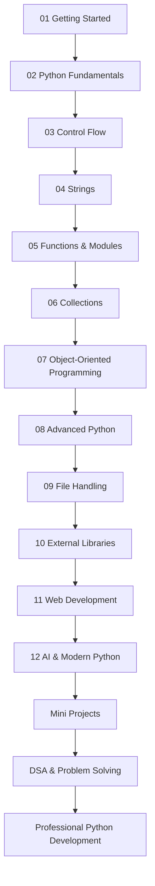
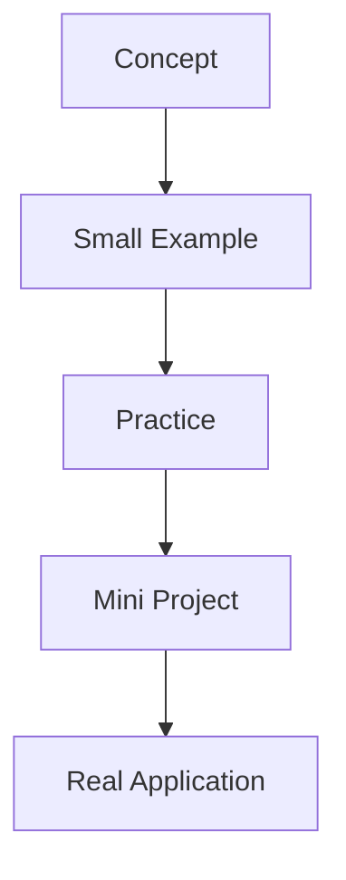
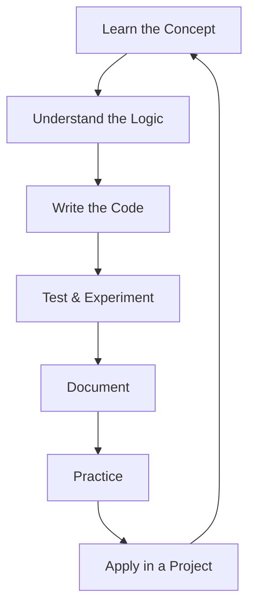
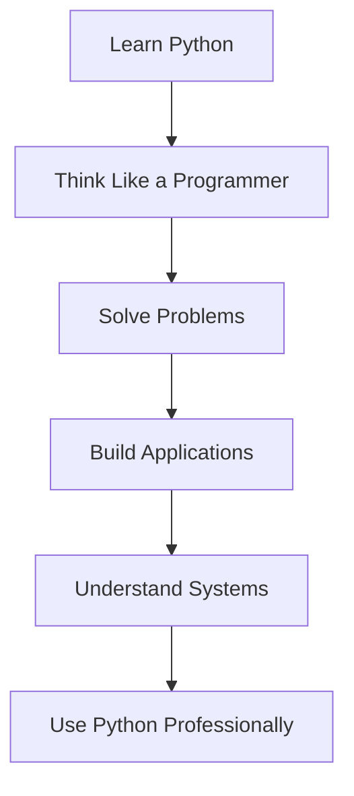
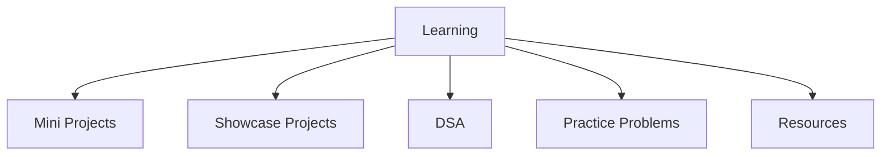

<div align="center">


# 01_Learning

### *A structured journey from Python fundamentals to modern Python development*


</div>

---

##  About This Folder

`01_Learning` is the **core learning workspace** of the **Programming-in-Python** repository.

This folder contains my structured Python learning journey — starting from the absolute basics and gradually progressing toward advanced Python, external libraries, web development, AI, and modern Python development practices.


> *This folder represents the learning phase of my Python journey.*
>
> The rest of the repository builds on the knowledge developed here.

---

##  Learning Vision

The vision of `01_Learning` is simple:

> *Build Python skills systematically — from writing the first program to building real-world applications.*

The learning path is designed around five stages:

```text
Learn
  ↓
Understand
  ↓
Practice
  ↓
Apply
  ↓
Build
```

Every module focuses on a specific part of Python and contributes to the larger goal of becoming a confident Python developer.

---

#  Learning Roadmap



The modules are intentionally arranged so that each stage builds upon concepts learned earlier.

---

# Folder Structure

```text
01_Learning/
│
├── README.md
│
├── 01_Getting_Started/
│
├── 02_Python_Fundamentals/
│
├── 03_Control_Flow/
│
├── 04_Strings/
│
├── 05_Functions_and_Modules/
│
├── 06_Collections/
│
├── 07_Object_Oriented_Programming/
│
├── 08_Advanced_Python/
│
├── 09_File_Handling/
│
├── 10_External_Libraries/
│
├── 11_Web_Development/
│
└── 12_AI_and_Modern_Python/
```

Each directory represents one stage of the Python learning journey.

---

#  Module Overview

| #  | Module                                                           | Main Focus                                                                   |
| -- | ---------------------------------------------------------------- | ---------------------------------------------------------------------------- |
| 01 | [Getting Started](./01_Getting_Started/)                         | Programming introduction, Python setup, first programs and syntax            |
| 02 | [Python Fundamentals](./02_Python_Fundamentals/)                 | Variables, data types, input, output, operators and basic syntax             |
| 03 | [Control Flow](./03_Control_Flow/)                               | Conditions, loops, decision making and iteration                             |
| 04 | [Strings](./04_Strings/)                                         | Strings, indexing, slicing, methods and formatting                           |
| 05 | [Functions & Modules](./05_Functions_and_Modules/)               | Functions, arguments, return values, recursion, modules and scope            |
| 06 | [Collections](./06_Collections/)                                 | Lists, tuples, sets, dictionaries and collection operations                  |
| 07 | [Object-Oriented Programming](./07_Object_Oriented_Programming/) | Classes, objects, constructors, inheritance and polymorphism                 |
| 08 | [Advanced Python](./08_Advanced_Python/)                         | Decorators, dunder methods, exceptions, functional tools and advanced syntax |
| 09 | [File Handling](./09_File_Handling/)                             | File I/O, filesystem operations and command-line utilities                   |
| 10 | [External Libraries](./10_External_Libraries/)                   | Packages, virtual environments, APIs, regex and multithreading               |
| 11 | [Web Development](./11_Web_Development/)                         | Flask, templates, forms, APIs and web application development                |
| 12 | [AI & Modern Python](./12_AI_and_Modern_Python/)                 | AI-assisted development, LLM APIs and modern Python workflows                |

---

# 01_Getting Started

### Purpose

This module introduces programming and provides everything required to begin writing Python programs.

### Topics

* Introduction to Programming
* What is Python?
* Installing Python
* Installing and configuring VS Code
* Writing the first Python program
* Understanding Python syntax
* Running Python programs
* Basic development workflow


---

# 02_Python Fundamentals

### Purpose

This module establishes the foundation of the Python language.

### Topics

* Variables
* Data Types
* Typecasting
* User Input
* `print()`
* Comments
* Escape Sequences
* Operators
* Basic expressions
* Practice problems

### Learning Outcome

I should be able to:

* Store and manipulate data
* Take input from users
* Convert between data types
* Use arithmetic and logical operators
* Write basic Python programs independently

---

# 03_Control Flow and Loops

### Purpose

Control flow teaches Python how to make decisions and repeat operations.

### Topics

* `if`
* `elif`
* `else`
* Nested conditions
* `match-case`
* `for` loops
* `while` loops
* `break`
* `continue`
* `pass`
* Practice problems

### Core Question

> **How does a program decide what to do and when to repeat something?**

### Learning Outcome

I should be able to build programs involving:

* Decision making
* Repetition
* Validation
* Menu-driven programs
* Basic algorithmic logic

---

# 04_Strings

### Purpose

Strings are one of the most frequently used data types in Python.

### Topics

* Creating strings
* String indexing
* String slicing
* String methods
* String functions
* Formatting
* f-strings
* String practice problems

### Learning Outcome

I should be comfortable with:

```python
text[index]
text[start:end]
text.upper()
text.lower()
text.replace()
text.split()
f"{variable}"
```

and other common string operations.

---

# 05_Functions & Modules

### Purpose

This module introduces reusable and organized Python code.

### Topics

* Defining functions
* Function parameters
* Arguments
* Return values
* Default arguments
* Lambda functions
* Recursion
* Modules
* `pip`
* Variable scope
* Docstrings
* Practice problems

### Core Principle

```text
Repeated Logic
      ↓
   Function
      ↓
Reusable Code
      ↓
Better Program Structure
```

### Learning Outcome

I should be able to:

* Break large problems into smaller functions
* Write reusable code
* Understand function scope
* Import and use modules
* Understand basic package management

---

# 06_Collections

### Purpose

This module covers Python's core built-in collection data structures.

### Topics

### Lists

```python
[]
```

### Tuples

```python
()
```

### Sets

```python
set()
```

### Dictionaries

```python
{}
```

Additional concepts include:

* Collection operations
* Built-in methods
* Iteration
* Accessing and modifying data
* Choosing the appropriate collection
* Practice problems

### Learning Outcome

I should be able to select and use the appropriate data structure for a problem.

---

# 07_ Object-Oriented Programming

### Purpose

This module introduces object-oriented programming and teaches how to model real-world entities using code.

### Topics

* Introduction to OOP
* Classes
* Objects
* Constructors
* `__init__`
* Instance attributes
* Class attributes
* Methods
* Inheritance
* Polymorphism
* Method overriding
* Operator overloading
* Practice problems

### OOP Progression

```text
Class
  ↓
Object
  ↓
Attributes
  ↓
Methods
  ↓
Inheritance
  ↓
Polymorphism
  ↓
Reusable Object-Oriented Design
```

### Learning Outcome

I should be able to design basic object-oriented Python programs and understand how classes and objects work together.

---

# 08_Advanced Python

### Purpose

This module moves beyond basic Python syntax into more powerful language features.

### Topics

* Decorators
* Getters and setters
* Static methods
* Class methods
* Magic / Dunder methods
* Exception handling
* Custom errors
* `map()`
* `filter()`
* `reduce()`
* Walrus operator
* `*args`
* `**kwargs`
* Advanced practice

### Learning Outcome

The goal is to understand how Python provides powerful abstractions beyond basic programming constructs.

---

# 09_File Handling

### Purpose

Programs often need to store, read, modify, and organize data outside of memory.

This module introduces persistent data handling.

### Topics

* File I/O
* Opening files
* Reading files
* Writing files
* Appending files
* File modes
* `os`
* `shutil`
* File and directory operations
* Command-line utilities
* Practice problems

### Learning Outcome

I should be able to write programs that interact with files and the filesystem.

---

# 10_External Libraries

### Purpose

Python becomes significantly more powerful through its ecosystem of packages and libraries.

### Topics

* Virtual environments
* Package management
* `pip`
* Requests
* APIs
* Regular expressions
* Multithreading

### Learning Concept

```text
Python
  ↓
Standard Library
  ↓
Third-Party Packages
  ↓
APIs & Tools
  ↓
Real-World Applications
```

### Learning Outcome

I should understand how to create isolated environments, install packages, communicate with APIs, and use external Python functionality.

---

# 11_Web Development

### Purpose

This module introduces web development using Python and Flask.

### Topics

* Flask fundamentals
* Creating a Flask application
* Static websites
* Static files
* Forms
* Jinja2 templates
* Template inheritance
* URL routing
* Query parameters
* APIs
* `jsonify`
* Flash messages

### Development Progression

```text
Python
  ↓
Flask
  ↓
Routes
  ↓
Templates
  ↓
Forms
  ↓
APIs
  ↓
Web Applications
```

### Learning Outcome

I should be able to understand the basic architecture of Python web applications and build simple Flask applications.

---

# 12_AI & Modern Python

### Purpose

This module connects Python programming with modern AI-assisted development.

### Topics

* Using AI as a developer
* Responsible AI-assisted programming
* ChatGPT
* GitHub Copilot
* Cursor
* AI coding workflows
* LLM APIs
* Python + AI integration

### Core Principle

> **AI should accelerate learning and development — not replace understanding.**

The objective is to learn how to use AI as a development tool while still understanding the code being written.

---

#  Hands-On Learning

Learning concepts is only one part of this journey.

The course also includes practical projects that turn individual concepts into working programs.

### Project-Based Learning

The hands-on project progression includes:

| Project                          | Main Concepts                                       |
| -------------------------------- | --------------------------------------------------- |
|  Simple Calculator             | Input, operators, conditions, functions             |
|  Quiz Game | Control flow, questions, scoring, user interaction  |
|  PDF Merger                    | External libraries and file handling                |
|  News App                      | APIs, requests and data handling                    |
|  Drink Water Reminder          | Automation and Python scripting                     |
| AI Virtual Assistant          | Python + AI integration                             |
|  File Organizer                | Filesystem operations and automation                |
|  QR Code Generator             | External libraries and practical scripting          |
|  Flask Applications            | Python web development                              |
|  VidSnapAI                     | Python, Flask, AI, APIs, files and media processing |

These projects demonstrate the transition:




---

#  Learning Methodology

Every topic in this folder follows a practical learning cycle.



The purpose is to avoid **passive learning**.

Simply watching a tutorial is not considered completion.

The real goal is:

> **Understand → Write → Break → Fix → Practice → Build**


---


This makes the repository easier to navigate, maintain, and revisit.


---


### The philosophy is:

| Repository Area        | Purpose                         |
| ---------------------- | ------------------------------- |
| `01_Learning`          | Learn concepts                  |
| `02_Mini_Projects`     | Apply concepts                  |
| `03_Showcase_Projects` | Build polished applications     |
| `04_DSA`               | Develop problem-solving ability |
| `05_Practice_Problems` | Reinforce knowledge             |
| `06_Resources`         | Revise and reference            |

This separation keeps **learning, building, problem solving, and revision** organized instead of mixing everything together.

---


The concepts learned here become the foundation for the `04_DSA` section of the repository.

---


This keeps the focus on **ability rather than completion percentage**.

---


> **Don't copy code just to finish a lesson.**
>
> Rewrite it. Break it. Modify it. Understand why it works.

---


The goal is not to avoid errors.

The goal is to become better at **understanding and solving them**.

---


# Learning Objectives

By progressing through this entire folder, the goal is to be able to:

### Python Fundamentals

* Understand Python syntax
* Work with variables and data types
* Use operators
* Handle input and output
* Work with strings and collections

### Programming

* Write conditions
* Use loops
* Design functions
* Apply recursion
* Solve programming problems

### Software Design

* Organize code into modules
* Use classes and objects
* Apply OOP concepts
* Handle exceptions
* Work with files

### Python Ecosystem

* Install and manage packages
* Use virtual environments
* Work with APIs
* Use external libraries
* Understand regular expressions
* Work with multithreading

### Development

* Build Flask applications
* Create APIs
* Work with templates and forms
* Use Git and GitHub
* Build practical projects

### Modern Python

* Work with AI tools
* Understand LLM APIs
* Build AI-assisted applications
* Use Python for modern development workflows

---


The repository reorganizes these concepts into a structured long-term learning archive.

---

# Recommended Learning Order

If you are starting Python from scratch, follow this order:

### Phase 1 — Foundations

```text
01_Getting_Started
        ↓
02_Python_Fundamentals
        ↓
03_Control_Flow
```

### Phase 2 — Core Python

```text
04_Strings
        ↓
05_Functions_and_Modules
        ↓
06_Collections
```

### Phase 3 — Object-Oriented Python

```text
07_Object_Oriented_Programming
        ↓
08_Advanced_Python
```

### Phase 4 — Practical Python

```text
09_File_Handling
        ↓
10_External_Libraries
```

### Phase 5 — Application Development

```text
11_Web_Development
        ↓
12_AI_and_Modern_Python
```

### Phase 6 — Application & Problem Solving

```text
Mini Projects
      ↓
DSA
      ↓
Practice Problems
      ↓
Showcase Projects
```

---


Even small progress matters.

> **Consistency beats intensity.**

A single well-understood concept is more valuable than rushing through ten concepts without understanding them.


---

# Long-Term Goal

The ultimate purpose of `01_Learning` is not simply:

> **"Finish learning Python."**

The real goal is:



Python is the foundation.

The larger objective is to develop **strong programming, problem-solving, software-development, and engineering skills**.

---

# What Comes After This Folder?

Once the concepts in `01_Learning` become comfortable, the journey continues into the rest of the repository.

```text
01_Learning
     │
     ├── Learn Python
     │
     ↓
02_Mini_Projects
     │
     ├── Apply Python
     │
     ↓
03_Showcase_Projects
     │
     ├── Build Portfolio Projects
     │
     ↓
04_DSA
     │
     ├── Develop Problem-Solving Skills
     │
     ↓
05_Practice_Problems
     │
     ├── Strengthen Concepts
     │
     ↓
06_Resources
     │
     └── Revise & Reference
```

This creates a complete learning ecosystem rather than a collection of disconnected Python files.

---


If I can do all six, I truly understand the concept.

---
### Connection:


---


#  Learning Philosophy

> *Learn deeply.*
>
> *Practice consistently.*
>
> *Build honestly.*
>
> *Document everything important.*
>
> *Improve one commit at a time.*

The purpose of this folder is not to prove that I already know Python.

It is to prove that I am **continuously becoming better at it**.

---

##  Repository Navigation

| Destination                        | Purpose                           |
| ---------------------------------- | --------------------------------- |
|  [Repository Home](../README.md) | Main repository overview          |
|  `01_Learning`                   | Structured Python learning        |
|  `02_Mini_Projects`              | Practical Python projects         |
|  `03_Showcase_Projects`           | Portfolio-ready projects          |
|  `04_DSA`                        | Data structures and algorithms    |
|  `05_Practice_Problems`          | Additional problem solving        |
|  `06_Resources`                  | Learning resources and references |

---

##  Author

**Arnav Raj**

This folder is part of my long-term journey to become a stronger programmer and software developer.

I am using this repository to learn publicly, practice consistently, document my progress, and build real projects along the way.

---
<div align="center" >
Thankyou
</div>