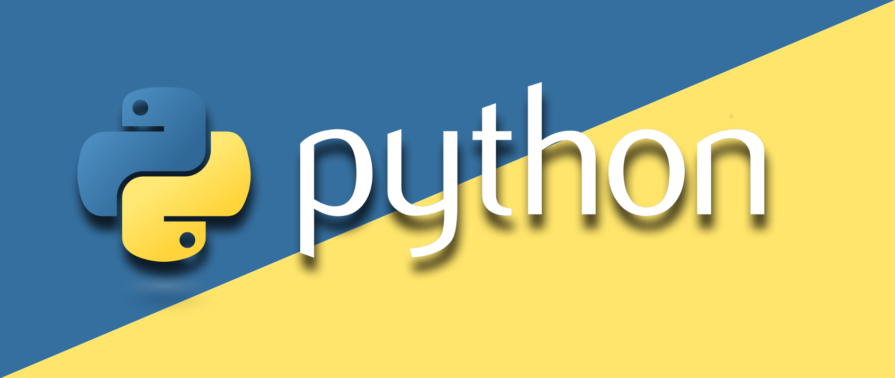
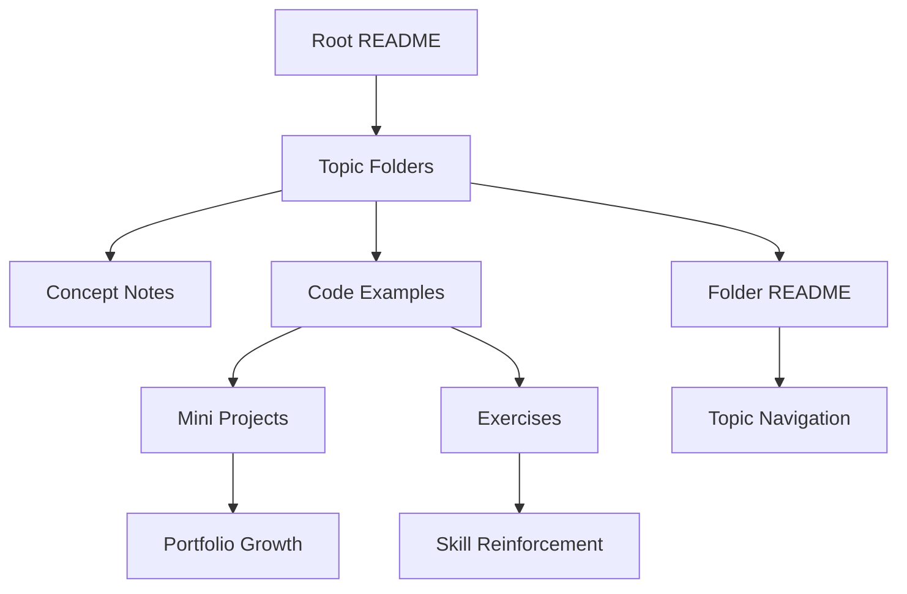
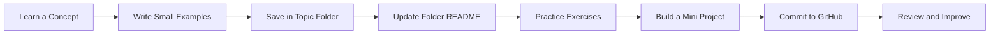
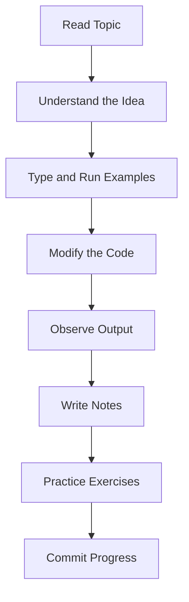
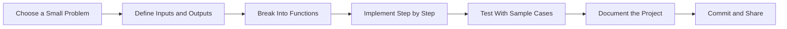
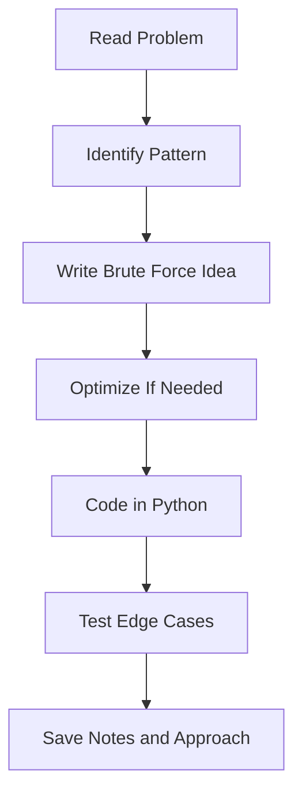
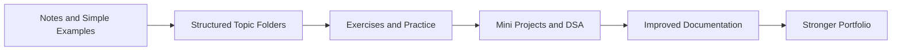
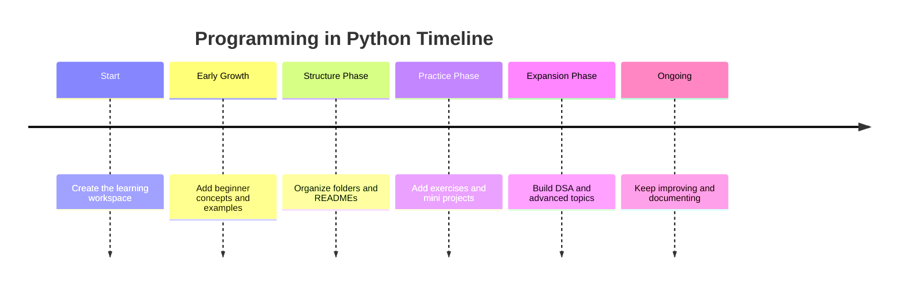
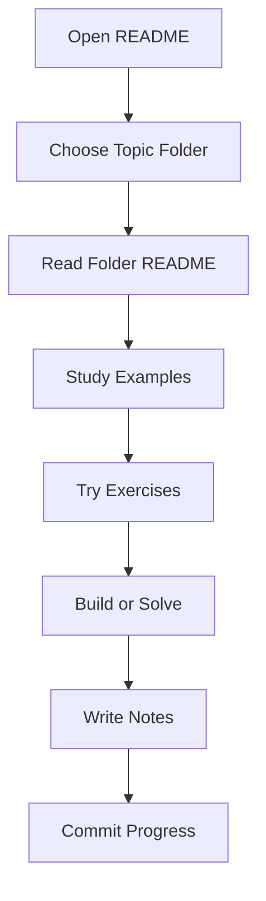

# Programming in Python

<div align="center">



# <span>Programming in Python</span>

<p><strong>A complete Python learning workspace documenting the journey from beginner to professional Python.</strong></p>

<p><strong>Beginner → Advanced Journey · Daily Commit Motivation · Open Source Learning in Public</strong></p>

<p>
	
	
	
	
    
	
	
</p>

<p>
	
</p>


</div>

---

## Table of Contents

- [Welcome](#welcome)
- [Repository Vision](#repository-vision)
- [Why This Repository Exists](#why-this-repository-exists)
- [Why I Started Tracking My Journey](#why-i-started-tracking-my-journey)
- [Repository Highlights](#repository-highlights)
- [Quick Snapshot](#quick-snapshot)
- [What You Will Find Here](#what-you-will-find-here)
- [Learning Philosophy](#learning-philosophy)
- [My Workflow](#my-workflow)
- [Repository Architecture](#repository-architecture)
- [Folder Structure](#folder-structure)
- [Folder Naming Convention](#folder-naming-convention)
- [Learning Roadmap & Beginner to Advanced Timeline](#learning-roadmap--beginner-to-advanced-timeline)
- [Repository Flowchart](#repository-flowchart)
- [Learning Workflow Flowchart](#learning-workflow-flowchart)
- [Python Learning Path](#python-learning-path)
- [Mini Projects](#mini-projects)
- [DSA Section](#dsa-section)
- [Folder READMEs Explanation](#folder-readmes-explanation)
- [How I Organize Code](#how-i-organize-code)
- [Documentation Standards](#documentation-standards)
- [Commit Strategy](#commit-strategy)
- [Branch Strategy](#branch-strategy)
- [Learning Journal](#learning-journal)
- [Progress Tracking](#progress-tracking)
- [Weekly Goals](#weekly-goals)
- [Milestones](#milestones)
- [Repository Timeline](#repository-timeline)
- [Current Focus](#current-focus)
- [Future Plans](#future-plans)
- [For Beginners](#for-beginners)
- [How to Navigate](#how-to-navigate)
- [Contribution Guidelines](#contribution-guidelines)
- [Resources](#resources)
- [Explore My Other Repositories](#explore-my-other-repositories)
- [Frequently Asked Questions](#frequently-asked-questions)
- [Repository Rules](#repository-rules)
- [Best Practices](#best-practices)
- [Motivation Section](#motivation-section)
- [Final Reflection](#final-reflection)
- [Connect With Me](#connect-with-me)
- [Author](#author)
- [License](#license)

---

## Welcome

Welcome to **Programming in Python**. This repository is my public learning workspace: a place where I study Python in a structured way, solve problems, build mini projects, practice Git and GitHub, and document the process honestly over time.

This is not a packaged course and not a polished tutorial series pretending to be finished. It is a living repository that grows with every topic I learn. The value here is the combination of code, notes, folder-level explanations, and visible progress.

> [!NOTE]
> If you are a beginner, you can start here and move forward topic by topic. If you are a recruiter, mentor, or fellow learner, this repo shows consistency, documentation discipline, and long-term growth.

---

## Repository Vision

My vision is to turn this repository into a complete, beginner-friendly, and professionally organized Python learning archive. Every topic should be easy to find, easy to understand, and easy to revisit later.

The repository is designed to do three things at the same time:

1. Teach Python clearly through simple examples.
2. Track my growth from basics to advanced topics.
3. Build a public portfolio that reflects discipline, consistency, and technical maturity.

---

## Why This Repository Exists

This repository exists because learning becomes stronger when it is visible, structured, and repeatable. I wanted a place where I could keep everything in one system instead of scattering notes across files, notebooks, and temporary folders.

It also gives structure to the learning process itself. When every topic gets its own folder, every example gets a purpose, and every concept gets written down, progress becomes measurable instead of vague.

---

## Why I Started Tracking My Journey

I started tracking my journey publicly because private learning is often forgotten, while public learning creates accountability.

Tracking my journey helps me:

- see how far I have come,
- identify weak areas faster,
- create better habits through regular commits,
- maintain momentum even when topics become difficult,
- build a record that future employers, collaborators, and learners can trust.

It also makes improvement visible. The commits, folders, notes, and projects become a timeline of effort, not just a collection of files.

---

## Repository Highlights

- Topic-wise learning folders for clear navigation.
- Beginner-friendly code examples with comments and context.
- Folder-level README files for deeper topic explanations.
- Mini projects that apply concepts in practical ways.
- DSA practice organized separately for focused problem solving.
- Notes, exercises, and resources collected in one place.
- Daily Git and GitHub practice through regular commits.
- A long-term learning journal that shows real progression.

---

## Quick Snapshot

| Area | Details |
|---|---|
| Repository type | Personal learning workspace |
| Primary language | Python |
| Focus | Beginner to advanced progression |
| Content style | Topic-based, practical, and documented |
| Audience | Beginners, self-learners, mentors, recruiters, and future me |
| Update rhythm | Regular commits and iterative expansion |
| Learning outputs | Notes, examples, exercises, projects, and DSA practice |
| Core principle | Learn in public, organize clearly, improve consistently |

> [!TIP]
> The repository is most useful when explored in order, but each folder is also meant to be self-contained.

---

## What You Will Find Here

| Category | What it contains | Why it matters |
|---|---|---|
| Topic folders | Focused learning by concept | Makes the repo easy to browse |
| Examples | Small runnable snippets | Helps turn theory into understanding |
| Exercises | Practice tasks and drills | Reinforces active learning |
| Mini projects | Small applied builds | Shows how topics connect in real use |
| DSA problems | Problem-solving practice in Python | Builds algorithmic thinking |
| Notes | Short conceptual explanations | Improves revision speed |
| Resources | Curated references and links | Keeps useful material in one place |
| Folder READMEs | Topic-specific documentation | Makes every directory more educational |
| Assets | Supporting visuals and reference files | Improves readability and presentation |

---

## Learning Philosophy

My learning philosophy is simple: understand one layer deeply before adding the next layer.

I prefer:

- simple examples before abstract explanations,
- repetition before speed,
- clarity before cleverness,
- structure before scale,
- documentation before forgetting,
- progress before perfection.

This repository reflects that philosophy. It is intentionally organized so that the learner can move from syntax to logic, from logic to projects, and from projects to problem solving.

> [!IMPORTANT]
> The goal is not to rush through Python. The goal is to build durable understanding and useful habits.

---

## My Workflow

My workflow is designed to keep learning practical and traceable.

1. Choose one topic or problem.
2. Read and understand the concept.
3. Write small examples by hand.
4. Add explanatory comments where helpful.
5. Save the topic inside the right folder.
6. Update the folder README if needed.
7. Test the code or run the example.
8. Commit the change with a meaningful message.
9. Review what was learned and what still feels unclear.

This workflow keeps the repository active while making sure the learning stays organized.

---

## Repository Architecture

The repository follows a documentation-first learning architecture.

- The root README acts as the homepage.
- Topic folders contain the actual learning material.
- Each major folder can include its own README for deeper explanation.
- Code examples stay close to the concepts they demonstrate.
- Projects and exercises are separated so that practice remains focused.

The design goal is discoverability. A newcomer should be able to open the repository and immediately understand where to start, where to learn next, and how the content is grouped.

### Repository Architecture Flow



---

## Folder Structure


```text
Programming-in-Python/
├── README.md
├── 01_Python_Basics/
├── 02_Operators/
├── 03_Control_Flow/
├── 04_Loops/
├── 05_Strings/
├── 06_Collections/
├── 07_Functions/
├── 08_Modules_and_Packages/
├── 09_Exception_Handling/
├── 10_File_Handling/
├── 11_Object_Oriented_Programming/
├── 12_Advanced_Functions/
├── 13_Built_in_Functions/
├── 14_Comprehensions/
├── 15_Collections_Module/
├── 16_Regular_Expressions/
├── 17_Date_and_Time/
├── 18_Math_Libraries/
├── 19_Functional_Programming/
├── 20_Python_Memory_Management/
├── 21_Multithreading/
├── 22_Multiprocessing/
├── 23_Asynchronous_Programming/
├── 24_Networking/
├── 25_Database_Programming/
├── 26_Web_Scraping/
├── 27_GUI_Development/
├── 28_Testing/
├── 29_Logging/
├── 30_Virtual_Environments/
├── 31_Advanced_Python_Concepts/
├── 32_Python_Standard_Libraries/
├── 33_Data_Analysis/
├── 34_Machine_Learning/
├── 35_Web_Development/
├── 36_Automation/
├── 37_DevOps_with_Python/
├── 38_Data_Structures/
├── 39_Algorithms/
├── 40_Mini_Projects/
├── 41_DSA_in_Python/
├── 42_Practice_Problems/
└── 43_Resources/
```

---

## Folder Naming Convention

I use clear folder names so the structure stays readable as the repository grows.

- Use short, descriptive names that communicate the topic.
- Prefer hyphenated names for multi-word folders.
- Keep related files inside the same topic folder.
- Use `README.md` inside folders when the folder needs explanation.
- Keep examples and exercises close to the topic they belong to.

Consistency matters more than clever naming. A beginner should be able to guess what a folder contains just by reading the name.


## Learning Roadmap & Beginner to Advanced Timeline

| Phase | What I Learn | Evidence in the repo | Outcome
|---|---|---|---| 
| 01 | Python Basics | Intro folders, first examples, notes | Understand syntax, variables, and program structure |
| 02 | Operators | Expressions, comparisons, and boolean logic |Build expressions, comparisons, and logic |
| 03 | Control Flow | Branching and decision making | Make decisions with conditions |
| 04 | Loops | Repetition and iteration patterns |Repeat work with for and while patterns |
| 05 | Strings | Text processing and formatting | Handle text cleanly and confidently |
| 06 | Collections | Lists, tuples, sets, and dictionaries |Work with core data collections |
| 07 | Functions | Reusable logic and scope |Reuse logic through well-structured functions |
| 08 | Modules and Packages | Cleaner structure and imports |Organize code across files and packages |
| 09 | Exception Handling | Safer code and error control |Write safer, more resilient programs |
| 10 | File Handling | Reading and writing files | Read and write persistent data |
| 11 | Object-Oriented Programming | Classes, objects, and design |Model real problems with classes and objects |
| 12 | Advanced Functions | Flexible function patterns |Use flexible callable patterns |
| 13 | Built-in Functions | Built-in capabilities and utilities | Master Python’s built-in tools |
| 14 | Comprehensions | Compact collection building |Write concise collection transformations |
| 15 | Collections Module | Specialized data structures |Use specialized collection types effectively |
| 16 | Regular Expressions | Pattern matching and extraction |Match and extract text patterns |
| 17 | Date and Time | Time-aware programming |Work with temporal data precisely |
| 18 | Math Libraries | Numeric operations and helpers | Use numeric and scientific helpers |
| 19 | Functional Programming | Map, filter, reduce, and composition |Think in functions, composition, and iteration |
| 20 | Python Memory Management | Runtime behavior and object lifecycle |Understand runtime behavior and resource use |
| 21 | Multithreading | Concurrent execution concepts |Handle concurrent tasks in Python |
| 22 | Multiprocessing | Parallel execution across processes |Scale work across processes |
| 23 | Asynchronous Programming | Event-driven workflow design |Build non-blocking workflows |
| 24 | Networking | Network communication basics |Communicate over network boundaries |
| 25 | Database Programming | Persistent structured data |Store and query structured data |
| 26 | Web Scraping | Extracting data from the web |Collect information from web pages |
| 27 | GUI Development | Desktop interaction and interfaces |Build interactive desktop interfaces |
| 28 | Testing | Confidence through verification |Verify behavior with confidence |
| 29 | Logging | Observability and diagnostics |Capture runtime information clearly |
| 30 | Virtual Environments | Dependency isolation and setup |Isolate dependencies cleanly |
| 31 | Advanced Python Concepts | Deeper language capabilities |Explore deeper language capabilities |
| 32 | Python Standard Libraries | Reusable built-in modules |Use the built-in ecosystem effectively |
| 33 | Data Analysis | Data inspection and transformation |Analyze and transform data |
| 34 | Machine Learning | Introductory model workflows |Introduce predictive workflows |
| 35 | Web Development | App structure and web delivery |Build browser-facing applications |
| 36 | Automation | Scripted productivity and task reduction |Reduce repetitive work with scripts |
| 37 | DevOps with Python | Operational support and deployment tasks | Support deployment and operational tasks |
| 38 | Data Structures | Problem-solving and organization |Strengthen problem-solving foundations |
| 39 | Algorithms | Efficient solution strategies |Learn systematic solution design |
| 40 | Mini Projects | Applied learning and portfolio pieces | Combine concepts into small builds |
| 41 | DSA in Python | Implementation-focused problem solving | Practice algorithmic implementation in Python |
| 42 | Practice Problems | Repetition and mastery building |Reinforce skills through repetition |
| 43 | Resources | Revision support and reference material |Keep references organized for long-term learning |


> [!NOTE]
> The timeline is not a race. It is a visible record of depth increasing over time.

---

## Repository Flowchart



---

## Learning Workflow Flowchart



---

## Python Learning Path

My Python learning path moves through each major layer in order:

**Python Basics → Core Python → Intermediate Python → Advanced Python → Libraries → Projects → DSA → Real-world Development → Professional Python**

1. **Python Basics** - syntax, variables, data types, and input/output.
2. **Core Python** - operators, control flow, loops, strings, collections, and functions.
3. **Intermediate Python** - modules, packages, exceptions, file handling, and OOP.
4. **Advanced Python** - advanced functions, built-ins, comprehensions, regex, date and time, math libraries, functional programming, memory management, concurrency, networking, and asynchronous programming.
5. **Libraries** - standard libraries, data analysis, and machine learning foundations.
6. **Projects** - mini projects, web development, automation, GUI development, and DevOps-style workflows.
7. **DSA** - data structures, algorithms, DSA in Python, and practice problems.
8. **Real-world Development** - databases, scraping, testing, logging, virtual environments, and deployment-minded coding.
9. **Professional Python** - scalable code organization, cleaner architecture, and maintainable engineering habits.

---

## Mini Projects

Mini projects are where concepts become tangible.

| Project Type | Purpose | Skills Reinforced |
|---|---|---|
| Calculator | Logic and functions | Branching, input handling, reusable code |
| Number guessing game | Control flow | Randomness, loops, user interaction |
| To-do tool | Data handling | Lists, files, persistence |
| Quiz app | Practical scripting | Functions, scoring, clean output |
| Password generator | String and random utilities | Modules, loops, parameters |
| Expense tracker | Structured data | Dictionaries, files, formatting |

Mini projects help me prove that I understand the topic well enough to use it.

### Mini Project Workflow



---

## DSA Section

DSA practice lives in its own section so problem solving remains focused and measurable.

The goal here is not only to solve problems, but to recognize patterns:

- arrays and strings,
- recursion,
- searching and sorting,
- stacks and queues,
- hash-based approaches,
- two-pointer and sliding-window techniques,
- basic tree and graph introductions as the repo matures.

### DSA Categories

| Category | Focus | Typical Practice |
|---|---|---|
| Arrays | Sequence processing | Traversal, indexing, subarrays |
| Strings | Text manipulation | Pattern checks, formatting, frequency |
| Recursion | Self-referential solutions | Base case thinking, decomposition |
| Searching | Finding items efficiently | Linear search, binary search |
| Sorting | Ordering data | Comparative thinking and tradeoffs |
| Hashing | Fast lookup | Dictionaries, sets, frequency maps |
| Stacks and queues | Order-sensitive processing | Balanced expressions, scheduling |

### DSA Workflow



---

## Folder READMEs Explanation

Each major folder can contain its own README to explain the purpose of that area.

Those folder READMEs should answer questions like:

- What is this folder for?
- Which concepts belong here?
- What order should I study the files in?
- Which examples are beginner-friendly?
- What should I understand before moving to the next folder?

This keeps the repository scalable. As the content grows, the documentation grows with it instead of becoming an afterthought.

---

## How I Organize Code

I keep code organized by topic, clarity, and teaching value.

- Small examples stay small.
- One file should usually teach one idea.
- Complex topics get broken into smaller parts.
- Function names should be descriptive.
- Variable names should explain intent.
- Comments are used to clarify reasoning, not to restate obvious syntax.

When code is educational, readability is part of correctness.

---

## Documentation Standards

I want every folder and file to communicate clearly.

My documentation standards are:

- explain the purpose before the details,
- show examples after the explanation,
- keep language simple and direct,
- use consistent headings and formatting,
- make navigation predictable,
- update docs whenever the structure changes.

The README files are not decoration. They are part of the learning system.

> [!TIP]
> Good documentation reduces confusion, improves revision speed, and makes the repository useful even months later.

---

## Commit Strategy

I use commits as part of the learning rhythm, not just as a version-control habit.

| Commit Type | Example | Why it helps |
|---|---|---|
| Topic addition | Add new folder for a concept | Shows expansion of knowledge |
| Example update | Improve code sample | Reflects refinement |
| Documentation | Add or improve README files | Makes learning visible |
| Practice | Add exercises or solved problems | Captures repetition |
| Project work | Add mini project files | Demonstrates application |
| Cleanup | Rename, restructure, simplify | Improves long-term maintainability |

Commit messages should be clear, short, and honest about what changed.

---

## Branch Strategy

I prefer a simple branch strategy that supports learning without unnecessary complexity.

- Keep the main branch stable and readable.
- Use feature branches when a change is large or experimental.
- Merge only when the topic, example, or project is ready to share.
- Keep branch names descriptive, such as `topic-strings`, `mini-project-calculator`, or `dsa-recursion`.

For a learning repository, simplicity is a feature. The branch strategy should support momentum, not slow it down.

---

## Learning Journal

This repository also acts as a learning journal.

I use it to record:

- what I studied,
- what I practiced,
- what confused me,
- what clicked after repetition,
- what I want to revisit later.

The journal effect matters because progress becomes easier to review when the learning trail is preserved.

### Repository Evolution



---

## Progress Tracking

I track progress by looking at both output and consistency.

| Metric | What it measures | How I use it |
|---|---|---|
| Topics completed | Breadth of learning | Shows coverage over time |
| Examples written | Practice volume | Reinforces concepts |
| Projects built | Applied understanding | Demonstrates utility |
| DSA problems solved | Problem-solving growth | Tracks algorithmic maturity |
| README improvements | Documentation quality | Shows craftsmanship |
| Commit consistency | Discipline | Makes growth visible |

### Progress Table

| Category | Current State | Next Step |
|---|---|---|
| 01-07 Foundation | Growing foundation | Deepen with more examples |
| 08-15 Core structure | In active practice | Add exercises and patterns |
| 16-23 Intermediate depth | Being refined | Apply in mini projects |
| 24-32 Advanced tooling | Growing steadily | Add real-world workflows |
| 33-37 Applied libraries | Expanding | Strengthen library-based work |
| 38-42 Problem solving | Building consistency | Add more problem types |
| 43 Resources | Organized for revision | Keep improving clarity and structure |

---

## Weekly Goals

Weekly goals keep the repository moving even when progress is incremental.

| Goal | Example | Outcome |
|---|---|---|
| Learn one topic deeply | Study one concept and its variations | Better retention |
| Add one folder or file set | Expand the repo in a controlled way | Better structure |
| Solve multiple practice items | Exercises and DSA problems | Better fluency |
| Improve documentation | Refine a folder README | Better navigation |
| Ship one small project or utility | Apply the concept | Stronger portfolio value |

---

## Milestones

Milestones help define meaningful checkpoints.

| Milestone | Meaning |
|---|---|
| First structured folder | The repo became topic-oriented |
| First folder README | The repo became more educational |
| First mini project | Learning turned practical |
| First DSA set | Problem-solving became a dedicated habit |
| Consistent commit streak | Discipline became visible |
| Advanced topic folders | The journey matured beyond basics |

---

## Repository Timeline

| Stage | Focus | Result |
|---|---|---|
| Start | Set up the learning workspace | A clear place to grow |
| Early growth | Add basics and examples | A beginner-friendly foundation |
| Structure phase | Organize by topic | Easier navigation |
| Practice phase | Add exercises and projects | Better retention and application |
| Expansion phase | Add DSA and advanced concepts | Stronger skill depth |
| Ongoing phase | Maintain and improve | Long-term repository maturity |

### Timeline View



---

## Current Focus

My current focus is to keep strengthening the foundation while expanding the repository in a disciplined way.

That means:

- improving topic coverage,
- making examples easier to understand,
- adding more practical exercises,
- documenting each folder clearly,
- building small projects that reinforce the core language,
- keeping the commit history consistent.

---

## Future Plans

As the repository grows, I want to add more depth and polish in areas such as:

- advanced Python features,
- richer mini projects,
- structured DSA problem sets,
- improved visual documentation,
- better learning checklists,
- possible reusable templates for future folders.

The long-term goal is a repository that remains useful years after it was first created.

---

## For Beginners

If you are new to programming, this repository is meant to be approachable.

Start with the simplest folder first and move gradually. Read the explanations, run the examples, and do not skip the practice files. The goal is to understand enough to explain the concept in your own words.

When something feels confusing, use the folder README, the examples, and the notes together. That combination is usually enough to make the idea click.

> [!TIP]
> Beginners do best when they learn in small steps and revisit the same concept more than once.

---

## How to Navigate

The repository is designed to be navigated in layers.

1. Start from this root README.
2. Open the topic folder that matches what you want to learn.
3. Read the folder README first.
4. Study the examples in order.
5. Run or modify the code.
6. Try the exercises.
7. Move to a mini project or DSA set when ready.

If you are exploring the repo casually, use the table of contents as your map.

### Study Workflow Flowchart



---

##  Contribution

If you have ideas to make this repository better, you are more than welcome to contribute!

Whether it's fixing a typo, improving documentation, adding better examples, or suggesting a cleaner approach, every contribution helps make this repository more valuable for everyone.

### You can contribute by:

-  Reporting issues or mistakes
-  Suggesting new ideas or improvements
-  Forking the repository
-  Submitting a Pull Request
-  Improving documentation
-  Adding beginner-friendly explanations or examples

> **Remember:** Every great repository grows through collaboration. Even the smallest improvement can make learning easier for someone else.

Let's learn, build, and grow together—one commit at a time. 🚀

---

## Resources

These are the kinds of resources that support the learning process well:

- the official Python documentation,
- beginner-friendly reference guides,
- practice platforms for exercises and DSA,
- articles that explain concepts with examples,
- notes written inside this repository for quick revision.

### Repository Contents

| Content Type | Status | Notes |
|---|---|---|
| Topic folders | Active and expanding | Core structure of the repo |
| README files | Actively maintained | Important for navigation |
| Mini projects | Planned and growing | Apply what I learn |
| DSA practice | Planned and growing | Build problem-solving habits |
| Notes and resources | Ongoing | Support revision and reference |
| Assets | Placeholder stage | Used for banners, diagrams, and visuals |

---

## Explore My Other Repositories

As this profile grows, I want my repositories to show different sides of my learning: Python fundamentals, projects, problem solving, and GitHub practice.

For now, the best way to explore more of my work is through my GitHub profile and any future repositories linked there.

---


---


## Best Practices

I try to keep the repository aligned with these practices:

- write readable code,
- keep examples small,
- use consistent formatting,
- name files and folders clearly,
- revise documentation when the structure changes,
- make each commit meaningful,
- keep the learning path visible,
- revisit older material regularly.

Small habits compound into strong results when applied consistently.

---

## Motivation

The motivation behind this repository is simple: I want my learning to become real, durable, and visible.

Python becomes easier when it is practiced consistently. Git becomes easier when it is used daily. Confidence grows when progress can be seen in folders, commits, and completed exercises.

This repository keeps me honest about that process.

---

## Final Reflection

This repository is more than a code dump. It is a record of intention.

Every folder added, every README improved, every example written, and every commit pushed tells the same story: a learner is building skill through structure, patience, and repetition.

If this repository becomes valuable to others, that will be a byproduct of building it properly for myself first.

---

## Connect With Me

If you want to follow the journey, the cleanest place to start is my GitHub profile and repository activity.

- GitHub: [ArnavRaj](https://github.com/ArnavRajDas)
- LinkedIn: [ArnavRaj](https://www.linkedin.com/in/arnav-raj-18983a33a/)
- Email:   [arnavrajdas@gmail.com](mailto:arnavrajdas@gmail.com) 

If you have ideas for improving the structure, documentation, or learning experience, open an issue or start a discussion where available.

---

## Author

**Arnav Raj**

This repository is maintained as a personal learning workspace and public record of Python growth.

---


<div align="center">

### Thanks for visiting

<sub>This repository will keep evolving as the learning continues.</sub>

</div>
