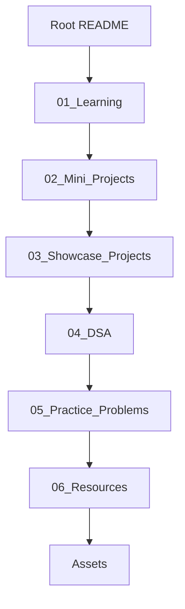
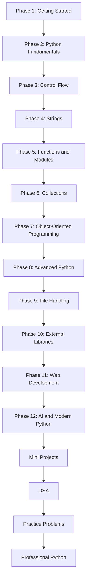
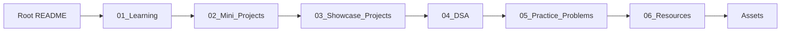
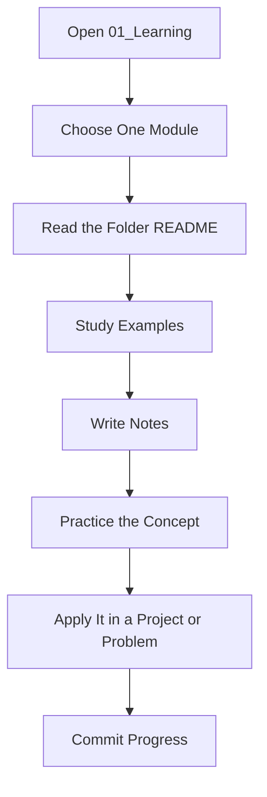
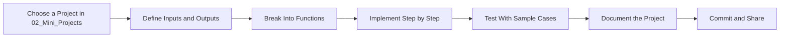
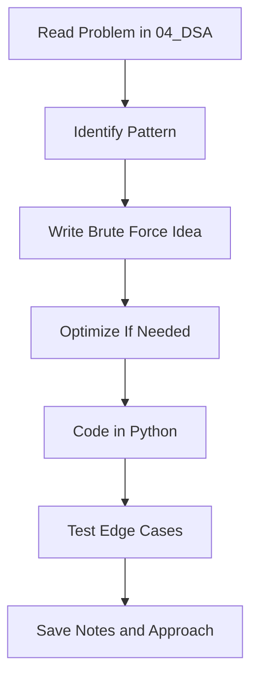
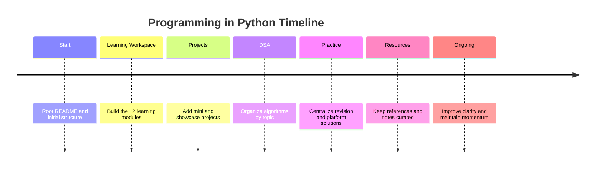
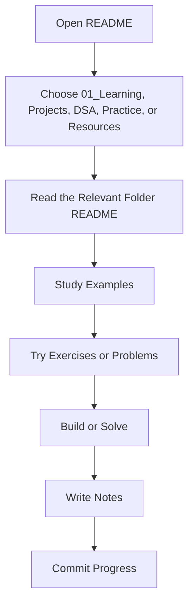

# Programming in Python

<div align="center">


# <span>Programming in Python</span>

<p><strong>A complete Python learning workspace documenting the journey from beginner to professional Python.</strong></p>

<p><strong>Beginner → Advanced Journey · Daily Commit Motivation · Open Source Learning in Public</strong></p>

<p>
	
	
	
	
    
	
	
</p>

<p>
	
</p>


</div>

---


## Welcome

Welcome to **Programming in Python**. This repository is my public learning workspace: a place where I study Python in a structured way, solve problems, build mini projects, practice Git and GitHub, and document the process honestly over time.

This is not a packaged course and not a polished tutorial series pretending to be finished. It is a living repository that grows with every topic I learn. The value here is the combination of code, notes, folder level explanations, and visible progress.

> [!NOTE]
> If you are a beginner, you can start here and move forward topic by topic. If you are a recruiter, mentor, or fellow learner, this repo shows consistency, documentation discipline, and long-term growth.

---

## Vision

My vision is to turn this repository into a complete, beginner-friendly, and professionally organized Python learning archive. Every topic should be easy to find, easy to understand, and easy to revisit later.

The repository is designed to do three things at the same time:

1. Teach Python clearly through simple examples.
2. Track my growth from basics to advanced topics.
3. Build a public portfolio that reflects discipline, consistency, and technical maturity.

---

## Why This Repository Exists

This repository exists because learning becomes stronger when it is visible, structured, and repeatable. I wanted a place where I could keep everything in one system instead of scattering notes across files, notebooks, and temporary folders.

It also gives structure to the learning process itself. When every topic gets its own folder, every example gets a purpose, and every concept gets written down, progress becomes measurable instead of vague.

---

## Why I Started Tracking My Journey

I started tracking my journey publicly because private learning is often forgotten, while public learning creates accountability.

Tracking my journey helps me:

- see how far I have come,
- identify weak areas faster,
- create better habits through regular commits,
- maintain momentum even when topics become difficult,
- build a record that future employers, collaborators, and learners can trust.

It also makes improvement visible. The commits, folders, notes, and projects become a timeline of effort, not just a collection of files.

---

## Repository Highlights

- Module-based learning folders for clear navigation.
- Beginner-friendly code examples with comments and context.
- Folder-level README files for deeper topic explanations.
- Mini projects that apply concepts in practical ways.
- DSA practice organized separately for focused problem solving.
- Notes, exercises, and resources collected in one place.
- Daily Git and GitHub practice through regular commits.
- A long-term learning journal that shows real progression.

---

## Quick Snapshot

| Area | Details |
|---|---|
| Repository  | Programming-in-Python |
| Primary language | Python |
| Focus | Beginner to advanced progression |
| Content style | Module-based, practical, and documented |
| Audience | Beginners, self-learners, mentors, recruiters, and future me |
| Update rhythm | Regular commits and iterative expansion |
| Learning outputs | Notes, examples, exercises, projects, and DSA practice |


> [!TIP]
> The repository is most useful when explored in order, but each folder is also meant to be self-contained.

---

## What You Will Find Here

| Category | What it contains | Why it matters |
|---|---|---|
| Learning modules | Focused learning by concept | Makes the repo easy to browse |
| Examples | Small runnable snippets | Helps turn theory into understanding |
| Exercises | Practice tasks and drills | Reinforces active learning |
| Mini projects | Small applied builds | Shows how topics connect in real use |
| DSA problems | Problem-solving practice in Python | Builds algorithmic thinking |
| Notes | Short conceptual explanations | Improves revision speed |
| Resources | Curated references and links | Keeps useful material in one place |
| Folder READMEs | Topic-specific documentation | Makes every directory more educational |
| Assets | Supporting visuals and reference files | Improves readability and presentation |

---


## My Workflow

My workflow is designed to keep learning practical and traceable.

1. Choose one topic or problem.
2. Read and understand the concept.
3. Write small examples by hand.
4. Add explanatory comments where helpful.
5. Save the topic inside the right folder.
6. Update the folder README if needed.
7. Test the code or run the example.
8. Commit the change with a meaningful message.
9. Review what was learned and what still feels unclear.

This workflow keeps the repository active while making sure the learning stays organized.

---

## Repository Architecture

The repository follows a documentation-first learning architecture.




---

## Folder Structure


```text
Programming-in-Python/
├── README.md
├── 01_Learning/
├── 02_Mini_Projects/
├── 03_Showcase_Projects/
├── 04_DSA/
├── 05_Practice_Problems/
├── 06_Resources/
├── Assets/
└── LICENSE
```

### Main Folder Overview

| Folder | Purpose |
|---|---|
| README.md | The entry point for the repository and the main navigation guide. |
| 01_Learning | The structured learning workspace for concepts, examples, and notes. |
| 02_Mini_Projects | Beginner-to-intermediate Python projects that apply the core modules. |
| 03_Showcase_Projects | Polished projects designed to highlight stronger implementation and presentation. |
| 04_DSA | Python implementations of data structures and algorithms, organized by topic. |
| 05_Practice_Problems | Centralized practice sets, revision questions, and platform solutions. |
| 06_Resources | Curated books, notes, cheat sheets, roadmaps, and reference material. |
| Assets | Visual support files such as banners, screenshots, and diagrams. |
| LICENSE | The legal terms for using and sharing the repository. |

### 01_Learning Structure

```text
01_Learning/
├── 01_Getting_Started/
├── 02_Python_Fundamentals/
├── 03_Control_Flow/
├── 04_Strings/
├── 05_Functions_and_Modules/
├── 06_Collections/
├── 07_Object_Oriented_Programming/
├── 08_Advanced_Python/
├── 09_File_Handling/
├── 10_External_Libraries/
├── 11_Web_Development/
└── 12_AI_and_Modern_Python/
```

| Module | What it covers |
|---|---|
| 01_Getting_Started | Setup, tools, execution basics, and the first steps into Python. |
| 02_Python_Fundamentals | Syntax, variables, data types, operators, and core language building blocks. |
| 03_Control_Flow | Conditions, loops, and decision-making patterns. |
| 04_Strings | Text handling, formatting, slicing, searching, and common string operations. |
| 05_Functions_and_Modules | Reusable logic, scope, imports, modular design, and simple packaging. |
| 06_Collections | Lists, tuples, sets, dictionaries, and practical collection patterns. |
| 07_Object_Oriented_Programming | Classes, objects, inheritance, encapsulation, and object-oriented thinking. |
| 08_Advanced_Python | Deeper language features, decorators, comprehensions, generators, and runtime concepts. |
| 09_File_Handling | Reading, writing, organizing, and working with persistent data. |
| 10_External_Libraries | Third-party packages and Python tools used beyond the standard library. |
| 11_Web_Development | Web-facing Python workflows, frameworks, APIs, and application structure. |
| 12_AI_and_Modern_Python | Modern Python workflows, automation, data-driven tools, and AI-assisted development. |

---


## Python Learning Path
### Learning Structure Flow

My Python learning path now follows the repository modules in a simple progression:



---

## Repository Flowchart



---

## Learning Workflow Flowchart




---

## Mini Projects

`02_Mini_Projects` contains multiple beginner-to-intermediate Python projects.

Each project is usually self-contained and includes:

- Source Code
- README
- Screenshots, if applicable
- Outputs
- Learning Outcomes
- Topics Used

Mini projects are where concepts become tangible.

| Project Type | Purpose | Skills Reinforced |
|---|---|---|
| Calculator | Logic and functions | Branching, input handling, reusable code |
| Number guessing game | Control flow | Randomness, loops, user interaction |
| To-do tool | Data handling | Lists, files, persistence |
| Quiz app | Practical scripting | Functions, scoring, clean output |
| Password generator | String and random utilities | Modules, loops, parameters |
| Expense tracker | Structured data | Dictionaries, files, formatting |

Mini projects help me prove that I understand the topic well enough to use it.

### Mini Project Workflow



---

## DSA Section

`04_DSA` contains Python implementations of data structures and algorithms.

The folder is organized by topic so problem solving remains focused and measurable.

The goal here is not only to solve problems, but to recognize patterns across:

- Arrays and strings
- Linked lists
- Stacks and queues
- Trees and graphs
- Searching and sorting
- Dynamic programming
- Greedy techniques
- Backtracking
- Recursion and problem decomposition

### DSA Categories

| Category | Focus | Typical Practice |
|---|---|---|
| Arrays | Sequence processing | Traversal, indexing, subarrays |
| Strings | Text manipulation | Pattern checks, formatting, frequency |
| Linked Lists | Node-based structures | Pointer movement, insertion, deletion |
| Stacks and Queues | Order-sensitive processing | Balanced expressions, scheduling |
| Trees | Hierarchical structures | Traversal, recursion, path reasoning |
| Graphs | Relationship modeling | Connectivity, traversal, shortest paths |
| Searching | Finding items efficiently | Linear search, binary search |
| Sorting | Ordering data | Comparative thinking and tradeoffs |
| Dynamic Programming | Reusing subproblems | Memoization, tabulation, optimization |
| Greedy | Local choice strategies | Build efficient solutions step by step |
| Backtracking | Constraint exploration | Trial, pruning, recursion |

### DSA Workflow



---

## Practice Problems

`05_Practice_Problems` keeps scattered practice in one organized place.

It contains:

- Course Practice Sets
- Revision Problems
- Topic-wise Questions
- Mixed Problems
- Codeforces Solutions
- Interview Questions


---


## Learning Progress

This repository also acts as a visible record of learning progress.

### Current Progress

- The new repository architecture is now centered on modules, projects, practice, and references.
- Learning content is moving into `01_Learning` for a cleaner progression.
- Applied work is split into `02_Mini_Projects`, `03_Showcase_Projects`, `04_DSA`, and `05_Practice_Problems`.


### Progress Table

| Area | Current State | Next Step |
|---|---|---|
| 01_Learning | Reorganized into 12 modules | Add more examples and notes |
| 02_Mini_Projects | Growing with beginner-to-intermediate builds | Improve documentation and outputs |
| 03_Showcase_Projects | Reserved for stronger portfolio work | Add polished end-to-end projects |
| 04_DSA | Organized by topic | Expand patterns and difficulty levels |
| 05_Practice_Problems | Centralized for revision | Add more mixed and platform-based sets |
| 06_Resources | Curated for quick revision | Keep references current and concise |

### Future Goals

- deepen the advanced modules,
- add more polished projects,
- expand DSA coverage,
- keep practice sets organized,
- maintain concise and reliable documentation.

### Repository Timeline



### Current Focus

My current focus is to keep the repository simple, scalable, and easy to navigate.

That means:

- strengthening module coverage,
- making each project self-contained,
- keeping DSA and practice sets easy to review,
- maintaining consistent documentation,
- preserving a clean commit history.

---

## For Beginners

If you are new to programming, this repository is meant to be approachable.

Start with `01_Learning/01_Getting_Started` and move gradually. Read the explanations, run the examples, and do not skip the practice files. The goal is to understand enough to explain the concept in your own words.

When something feels confusing, use the folder README, the examples, and the notes together. That combination is usually enough to make the idea click.

> [!TIP]
> Beginners do best when they learn in small steps and revisit the same concept more than once.

---

## How to Navigate

The repository is designed to be navigated in layers.

1. Start from this root README.
2. Open `01_Learning` for the structured learning path.
3. Read the module README first.
4. Study the examples in order.
5. Move to `02_Mini_Projects` when you want to apply the concept.
6. Use `04_DSA` and `05_Practice_Problems` for problem-solving practice.
7. Visit `06_Resources` whenever you need revision material.

If you are exploring the repo casually, use the table of contents as your map.

### Study Workflow Flowchart



---

## Contribution

If you have ideas to make this repository better, you are more than welcome to contribute!

Whether it's fixing a typo, improving documentation, adding better examples, or suggesting a cleaner approach, every contribution helps make this repository more valuable for everyone.

### You can contribute by:

-  Reporting issues or mistakes
-  Suggesting new ideas or improvements
-  Forking the repository
-  Submitting a Pull Request
-  Improving documentation
-  Adding beginner-friendly explanations or examples

> **Remember:** Every great repository grows through collaboration. Even the smallest improvement can make learning easier for someone else.

Let's learn, build, and grow together—one commit at a time. 🚀

---

## Resources

`06_Resources` keeps the learning references that support the repository in one place.

These are the kinds of resources that support the learning process well:

- the official Python documentation,
- beginner-friendly reference guides,
- practice platforms for exercises and DSA,
- articles that explain concepts with examples,
- notes written inside this repository for quick revision.

### Repository Contents

| Content Type | Status | Notes |
|---|---|---|
| Learning modules | Active and expanding | Core structure of the repo |
| README files | Actively maintained | Important for navigation |
| Mini projects | Planned and growing | Apply what I learn |
| DSA practice | Planned and growing | Build problem-solving habits |
| Practice problems | Ongoing | Support revision and interview prep |
| Resources | Curated and growing | Support revision and reference |
| Assets | Active | Used for banners, diagrams, and visuals |

---

## Explore My Other Repositories

As this profile grows, I want my repositories to show different sides of my learning: Python fundamentals, projects, problem solving, and GitHub practice.

For now, the best way to explore more of my work is through my GitHub profile and any future repositories linked there.

---


---


## Best Practices

I try to keep the repository aligned with these practices:

- write readable code,
- keep examples small,
- use consistent formatting,
- name files and folders clearly,
- revise documentation when the structure changes,
- make each commit meaningful,
- keep the learning path visible,
- revisit older material regularly.

Small habits compound into strong results when applied consistently.

---

## Motivation

The motivation behind this repository is simple: I want my learning to become real, durable, and visible.

Python becomes easier when it is practiced consistently. Git becomes easier when it is used daily. Confidence grows when progress can be seen in folders, commits, and completed exercises.

This repository keeps me honest about that process.

---


## Connect With Me

If you want to follow the journey, the cleanest place to start is my GitHub profile and repository activity.

- GitHub: [ArnavRaj](https://github.com/ArnavRajDas)
- LinkedIn: [ArnavRaj](https://www.linkedin.com/in/arnav-raj-18983a33a/)
- Email:   [arnavrajdas@gmail.com](mailto:arnavrajdas@gmail.com) 

If you have ideas for improving the structure, documentation, or learning experience, open an issue or start a discussion where available.

---

## Author

**Arnav Raj**

This repository is maintained as a personal learning workspace and public record of Python growth.

This repository is more than a code dump. It is a record of intention.

Every folder added, every README improved, every example written, and every commit pushed tells the same story: a learner is building skill through structure, patience, and repetition.

If this repository becomes valuable to others, that will be a byproduct of building it properly for myself first.

---


<div align="center">

### Thanks for visiting

<sub>This repository will keep evolving as the learning continues.</sub>

</div>
